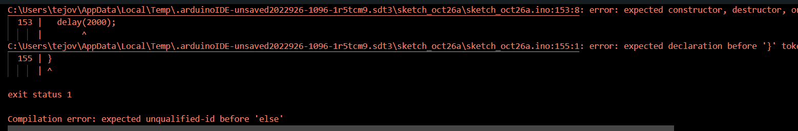

# Arduino day and night lighting :smiley:
Name: Tejo van der Burg 
 
Subject: IOT
 
Date 27-10-2022
 
 

## Required Hardware 
1. Arduino (esp8266).
2. Ledstrip arduino.
3. A Laptop with arduino installed
 

## Intro
So for a school subject called IOT which is about the internet of things I came up with an idea of a smart bed. One of the features was that the lighting in the room will change between day or night. With durting daytime a bright light and overnight a more orange light. So in this manual I will explain how to make a light difference between day and night thanks to Arduino and the led strip of Arduino.
 

## (1) Library
Instal the library called NTPClinent by Fabrice Weinberg.

## (2) Copy the code
Before you set up the code don't forget to choose the right board and the right com port. 
~~~
#include <ESP8266WiFi.h>
#include <NTPClient.h>
#include <WiFiUdp.h>

// Replace with your network credentials
const char *ssid     = "REPLACE_WITH_YOUR_SSID";
const char *password = "REPLACE_WITH_YOUR_PASSWORD";

// Define NTP Client to get time
WiFiUDP ntpUDP;
NTPClient timeClient(ntpUDP, "pool.ntp.org");

//Week Days
String weekDays[7]={"Sunday", "Monday", "Tuesday", "Wednesday", "Thursday", "Friday", "Saturday"};

//Month names
String months[12]={"January", "February", "March", "April", "May", "June", "July", "August", "September", "October", "November", "December"};

void setup() {
  // Initialize Serial Monitor
  Serial.begin(115200);
  
  // Connect to Wi-Fi
  Serial.print("Connecting to ");
  Serial.println(ssid);
  WiFi.begin(ssid, password);
  while (WiFi.status() != WL_CONNECTED) {
    delay(500);
    Serial.print(".");
  }

// Initialize a NTPClient to get time
  timeClient.begin();
  // Set offset time in seconds to adjust for your timezone, for example:
  // GMT +1 = 3600
  // GMT +8 = 28800
  // GMT -1 = -3600
  // GMT 0 = 0
    timeClient.setTimeOffset(7200);
}

void loop() {
  timeClient.update();

  time_t epochTime = timeClient.getEpochTime();
  Serial.print("Epoch Time: ");
  Serial.println(epochTime);
  
  String formattedTime = timeClient.getFormattedTime();
  Serial.print("Formatted Time: ");
  Serial.println(formattedTime);  

  int currentHour = timeClient.getHours();
  Serial.print("Hour: ");
  Serial.println(currentHour);  

  int currentMinute = timeClient.getMinutes();
  Serial.print("Minutes: ");
  Serial.println(currentMinute); 
   
  int currentSecond = timeClient.getSeconds();
  Serial.print("Seconds: ");
  Serial.println(currentSecond);  

  String weekDay = weekDays[timeClient.getDay()];
  Serial.print("Week Day: ");
  Serial.println(weekDay);    

  //Get a time structure
  struct tm *ptm = gmtime ((time_t *)&epochTime); 

  int monthDay = ptm->tm_mday;
  Serial.print("Month day: ");
  Serial.println(monthDay);

  int currentMonth = ptm->tm_mon+1;
  Serial.print("Month: ");
  Serial.println(currentMonth);

  String currentMonthName = months[currentMonth-1];
  Serial.print("Month name: ");
  Serial.println(currentMonthName);

  int currentYear = ptm->tm_year+1900;
  Serial.print("Year: ");
  Serial.println(currentYear);

  //Print complete date:
  String currentDate = String(currentYear) + "-" + String(currentMonth) + "-" + String(monthDay);
  Serial.print("Current date: ");
  Serial.println(currentDate);

  Serial.println("");

  delay(2000);
}
~~~
Change by the WIFI settings the ssid and password to yours.
If that is the case you will get in your serial monitor a message with the current day and time.

## (3) If Else with a certain time
Add this code all the way down in the void loop.
~~~
if ( currentHour == 14) {
    Serial.println("Hello it is 14");
// do stuff if the condition is true
}else{
      Serial.println("Hello it's not 14");
}
~~~
If the hour is 14 you will get this message on your serial monitor “Hello it is 14”. If that is not the case you will get the message “Hello it is not 14”. Also don't forget to put two of a '=='instead of one.

## (4) Error 1 the importance of the else in the if else.
So when I used the If else for the first time every time I uploaded the code it would always do the if even when I changed the hour to a hour it was not at the time. At this point I actually did not use an else statement. But when I started using an else statement it would work immediately. So if you use an if statement in your Arduino code give it an else statement otherwise the Arduino will always do the if even if it's not correct.

## (5) Adafruit joins the party
So the next step is to add adafruit into the conversation. Go to examples then go to adafruit neo pixel and then go to simple
an copy certain parts of the code in certain places.
Copy this between the library’s and the WIFI settings.
~~~
#include <Adafruit_NeoPixel.h>
#ifdef __AVR__
 #include <avr/power.h> // Required for 16 MHz Adafruit Trinket
#endif

// Which pin on the Arduino is connected to the NeoPixels?
#define PIN        6 // On Trinket or Gemma, suggest changing this to 1

// How many NeoPixels are attached to the Arduino?
#define NUMPIXELS 16 // Popular NeoPixel ring size

// When setting up the NeoPixel library, we tell it how many pixels,
// and which pin to use to send signals. Note that for older NeoPixel
// strips you might need to change the third parameter -- see the
// strandtest example for more information on possible values.
Adafruit_NeoPixel pixels(NUMPIXELS, PIN, NEO_GRB + NEO_KHZ800);

#define DELAYVAL 500 // Time (in milliseconds) to pause between pixels
~~~
Don't forget to change the the pin into D5 and change the number om NUMPIXELS into the amount of your ledstrip.
 
Put the next type of code on the lower side of the void loop.
~~~
void loop() {
  pixels.clear(); // Set all pixel colors to 'off'

  // The first NeoPixel in a strand is #0, second is 1, all the way up
  // to the count of pixels minus one.
  for(int i=0; i<NUMPIXELS; i++) { // For each pixel...

    // pixels.Color() takes RGB values, from 0,0,0 up to 255,255,255
    // Here we're using a moderately bright green color:
    pixels.setPixelColor(i, pixels.Color(0, 150, 0));

    pixels.show();   // Send the updated pixel colors to the hardware.

    delay(DELAYVAL); // Pause before next pass through loop
  }
}
~~~
 
At last change the if else statements made in step 4 into this.

~~~

if ( currentHour == 14) {
    Serial.println("Hello it's 14");
  for(int i=0; i<NUMPIXELS; i++) { // For each pixel...

    // pixels.Color() takes RGB values, from 0,0,0 up to 255,255,255
    // Here we're using a moderately bright green color:
        pixels.setPixelColor(i, pixels.Color(123, 132,213));

    pixels.show();   // Send the updated pixel colors to the hardware.
    delay(DELAYVAL); // Pause before next pass through loop
  }
}else{
      Serial.println("Hello it's not 14");
        for(int i=0; i<NUMPIXELS; i++) { // For each pixel...

    // pixels.Color() takes RGB values, from 0,0,0 up to 255,255,255
    // Here we're using a moderately bright green color:
    pixels.setPixelColor(i, pixels.Color(28, 70, 10));

    pixels.show();   // Send the updated pixel colors to the hardware.

    delay(DELAYVAL); // Pause before next pass through loop
  }
}
~~~

If you upload the code this will give the led strip a silver light if it is the 14th hour of the day if it is any other hour the light will turn into green.
 
## (6) Error 2 forgetting a bracket
When I copied the code from the adafruit code to the one of the time I accidentally copied a } to much then I got this error . You can actually see on which line of the code the bracket stands on the error message. Use that to detect and delete the bracket.

## (7) Error 3 Com port randomly disappears
So at one point I saved my progress because I was scared to maybe lose my progress. So I did that but after the save when I uploaded some changes I got the following error message . So this is actually an error message that can be quite common in my case and is very easy to fix. So to fix this problem you need to close your Arduino program and just re-open it. Than select the right board and com port and your good to go.

## (8) Make is ready for the night
So the last step is to make it ready for the night. I decided to code it that from 0 to 8 the night mode will be activated, the rest of the day the light is the day version. The way I did this was with an > sign.

 If you change the if else code in this you should be ready to go. Below you will see the day and the night version of the lights.
  
## List of used sources
[Time Arduino](https://randomnerdtutorials.com/esp8266-nodemcu-date-time-ntp-client-server-arduino/)
 
[If else in arduino](https://docs.arduino.cc/built-in-examples/control-structures/ifStatementConditional/)

